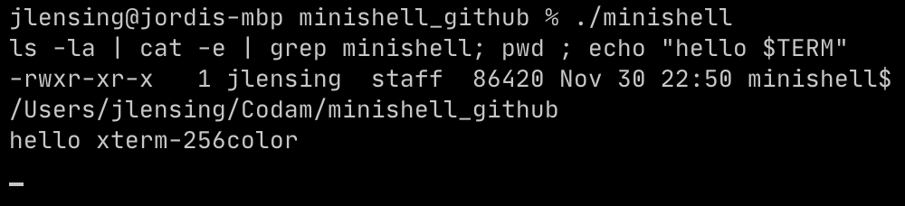

# Minishell 

A minimalistic shell based on bash

It's able to launch a executable based on relative, absolute path or the PATH variable

# Builtins
* echo with option -n
* cd with relative or absolute path
* pwd without any options
* export without options
* unset without options
* env without options or arguments
* exit without options

# Input features
* ; seperates commands
* ' and " work as in bash with the exception of multiline commands
* < > >> work as in bash except for file descriptor aggregation
* | work as in bash
* Environmental variables ($ followed by characters) work as in bash
* $? works as in bash
* ctrl-C, ctrl-D ctrl-\ work as in bash
* up and down arrows to scroll trough history

# Credits
* Raoul Verschoor - https://github.com/Raoulv48
* Jordi Lensing - https://github.com/Axenth
